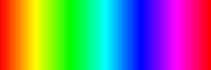
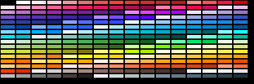
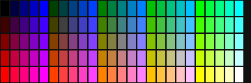
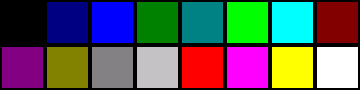

# Getting started

Palettes is a compact color source for PyDevices apps. Most code uses it by
creating one palette object, then indexing it to pick colors for fills,
graduated backgrounds, progress bars, badges, and other UI states.

## Setup

Install from [PyDevices MIP](installation.md) for MicroPython or [TestPyPI](installation.md) for CPython:

```python
import mip
mip.install("palettes", index="https://PyDevices.github.io/mip")
```

For a development clone, put `lib/` on `PYTHONPATH` or copy `lib/palettes/` to your device.

## A practical pattern

The most common workflow is to create a palette once and then reuse it through
an app or a draw loop:

```python
from palettes import get_palette

# Match the display's native color depth.
palette = get_palette(name="wheel", color_depth=16, length=256, saturation=1.0)

# Use palette values for fills, gradients, and status colors.
for i in range(16):
    display_drv.fill_rect(0, i * 8, 80, 8, palette[i * 16])
```

If the display expects byte-swapped 16-bit values, pass `swapped=True` to the
palette constructor so the integer colors match the hardware's byte order.

## Palette types

| `name` | Class | Typical use |
|--------|-------|-------------|
| `"default"` | `Palette` | Small named Windows-style color set |
| `"wheel"` | `WheelPalette` | Gradients and continuous color ramps |
| `"cube"` | `CubePalette` | Finite sets of evenly spaced colors |
| `"material_design"` | `MDPalette` | UI themes and semantic color families |

### 1. Color Wheel (`"wheel"`)


### 2. Material Design (`"material_design"`)


### 3. Color Cube (`"cube"`)


### 4. Named Windows-16 (`"default"`)


## Examples worth reading

The best real-world examples live in the pydevices-examples repo under the examples tree:

- `palettes_demo.py` — cycles wheel, cube, and Material Design palettes
- `graphics_simpletest.py` and `feathers.py` — use palette values for fills and drawing
- `console_advanced_demo.py` and `calc_graphics.py` — show palette reuse in larger UIs

PyScript installs `palettes` at runtime via `# pyscript mip: palettes`.
